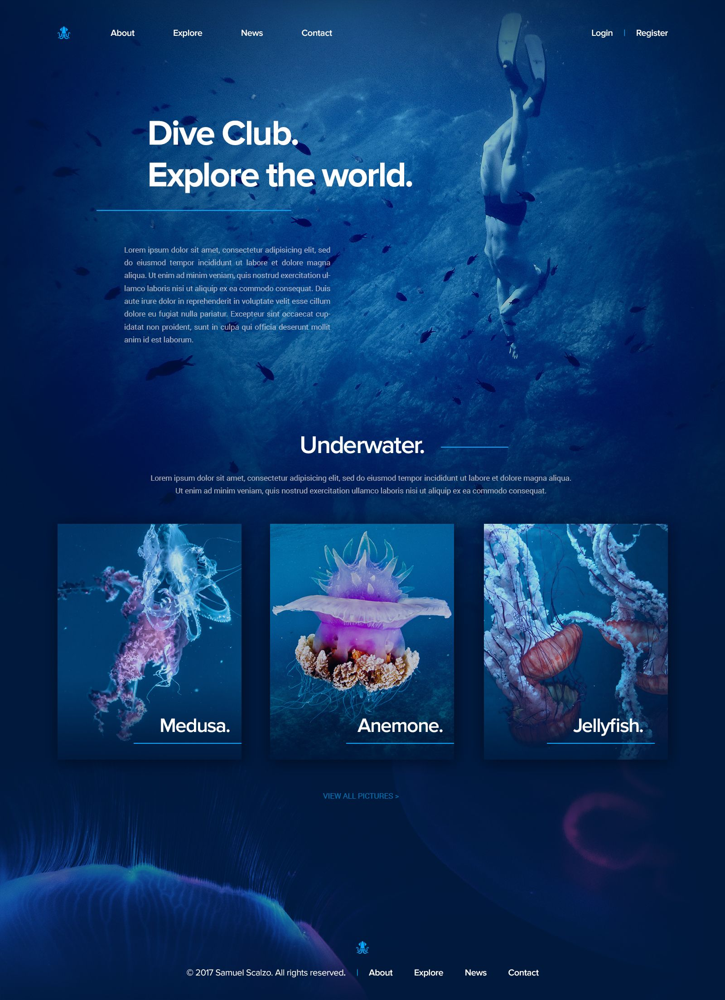

# Project Name
> This is a clone of a one page site that is an underwater site.  
<!-- If you have the project hosted somewhere, include the link here. -->

## Table of Contents
* [html file](index.html)
* [css file](index.css)
* [js file](index.js)
* [js file](page.js))

<!-- * [License](#license) -->

## General Information
- This a clone of a website page
- This cloned page demonstrates the use of HTML file, CSS rules, JavaScript DOM Manipulation Project and include ES6 + Arrow 
functions
- This is a project from Girlcode as part of our assignment collecton.
<!-- You don't have to answer all the questions - just the ones relevant to your project. -->

## Languages Used
- HTML
- Javascript
- CSS

## Features
List the ready features here:
- One page site

## Screenshots
      
<!-- If you have screenshots you'd like to share, include them here. -->

## Usage
The website where this site is cloned from is originally used to show the underwater experience that is given to clients
- This clone is a one page site to copy how the site looks.

## Project Status
Project is: _no longer being worked on_. As it has already been submitted.

## Room for Improvement
Include the correct export and import of module to entry/ external file

## Acknowledgements
Give credit here.
- This project was inspired by Girlcode 
- Many thanks to our Girlcode instructor

## Contact
Created by [nolithaprincess@gmail.com](https://www.gmail.com) - feel free to contact me!

<!-- Optional -->
<!-- ## License -->
<!-- This project is open source and available under the [... License](). -->

<!-- You don't have to include all sections - just the one's relevant to your project -->

